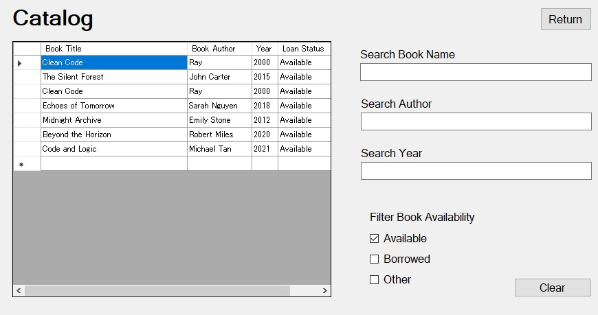
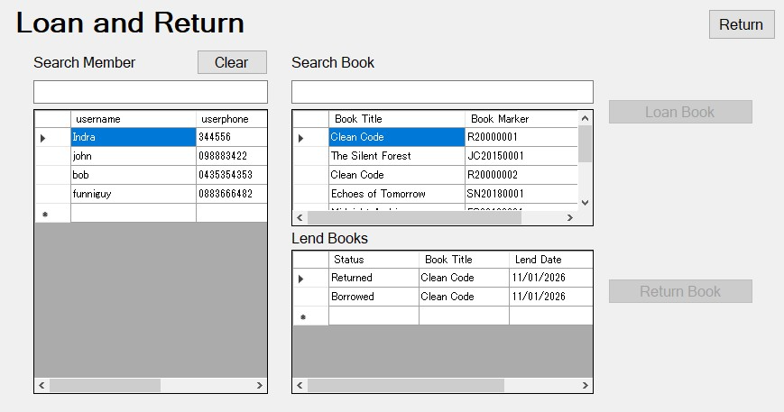
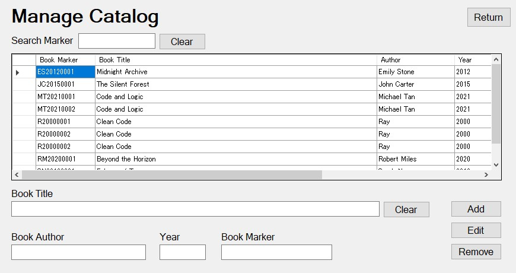
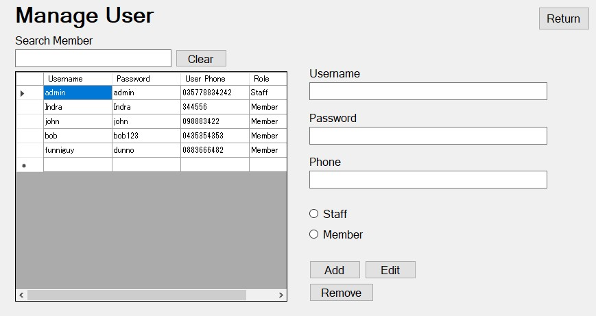
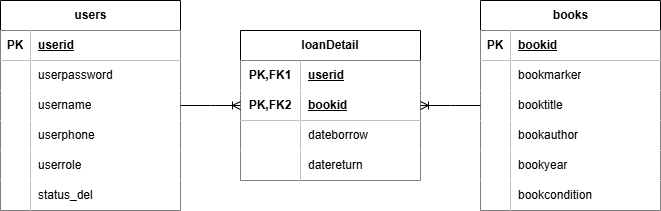

# Simple Library APP

Window Based Library Management System
Manages Book catalog, users, and loans

Author : Alberto Halim Limantoro

---

## ---- Screenshots ----

### Main Menu

### Catalog Viewer

### Manage Lease

### Manage Catalog

### Manage User

## ---- Features ----

### Staff
> Track book loans
> Return and loan books through the sistem
> Manage members and staff
> Manage book inventory

### Member
> View catalog
> See available books
> Filter via title, author, or year

### System
- Member/Staff login feature
- Fast and Responsive design
- Real-time updates
- SQL Database intergration (set to localhost currently)

## ---- Tech Stack ----

### IDE
Microsoft Visual Studio 2022
.NET Framework 4.8

### Frontend
Windows Forms (WinForms)

### Backend
MySQL Server
MySQL Workbench
XAMPP

## ---- Quick Start ----

### Prerequisites
> using a Window Machine (Emulator works)
> Visual Studio 2022/2026

### Installation
> Download the files from here
> Run/Build on your visual studio

### Installation
> Nuget Package MySQL.Client

## ---- Project Structure ----

📦 
├─ .gitattributes
├─ .gitignore
├─ Github
│  └─ Asset
│     ├─ Book.jpg
│     ├─ Book.png
│     ├─ Catalog.jpg
│     ├─ Catalog.png
│     ├─ Loan.jpg
│     ├─ Loan.png
│     ├─ MainMenu.jpg
│     ├─ MainMenu.png
│     ├─ User.jpg
│     └─ User.png
├─ LibraryApp.sln
├─ LibraryApp
│  ├─ App.config
│  ├─ FormCatalog.Designer.cs
│  ├─ FormCatalog.cs
│  ├─ FormCatalog.resx
│  ├─ FormHistory.Designer.cs
│  ├─ FormHistory.cs
│  ├─ FormHistory.resx
│  ├─ FormLogin.Designer.cs
│  ├─ FormLogin.cs
│  ├─ FormLogin.resx
│  ├─ FormMain.Designer.cs
│  ├─ FormMain.cs
│  ├─ FormMain.resx
│  ├─ FormMainMenu.Designer.cs
│  ├─ FormMainMenu.cs
│  ├─ FormMainMenu.resx
│  ├─ FormManageCatalog.Designer.cs
│  ├─ FormManageCatalog.cs
│  ├─ FormManageCatalog.resx
│  ├─ FormManageLoan.Designer.cs
│  ├─ FormManageLoan.cs
│  ├─ FormManageLoan.resx
│  ├─ FormManageUser.Designer.cs
│  ├─ FormManageUser.cs
│  ├─ FormManageUser.resx
│  ├─ Global Variable
│  │  ├─ ClassSQLComponent.cs
│  │  └─ UserComponent.cs
│  ├─ LibraryApp.csproj
│  ├─ Program.cs
│  ├─ Properties
│  │  ├─ AssemblyInfo.cs
│  │  ├─ Resources.Designer.cs
│  │  ├─ Resources.resx
│  │  ├─ Settings.Designer.cs
│  │  └─ Settings.settings
│  ├─ Resources
│  │  ├─ img_catalog.jpg
│  │  ├─ img_inventory.jpg
│  │  ├─ img_loan.jpg
│  │  └─ img_user.jpg
│  ├─ SQL
│  │  ├─ DBLibrary.sql
│  │  └─ LibraryAppERD.png
│  └─ packages.config
└─ README.md

## ---- Database Schema ----

### ERD DIAGRAM

### Tables

**Users**
> userid (UUID) [PK]
> userpassword (VARCHAR)
> username (VARCHAR)
> userphone (VARCHAR)
> userrole (VARCHAR)
> status_del (BOOL) default false

**Books**
> bookid (UUID) [PK]
> bookmarker (VARCHAR)
> booktitle (VARCHAR)
> bookauthor (VARCHAR)
> bookyear (INT)
> bookcondition (VARCHAR) default 'G'

**LoanDetail**
> bookid (UUID) [FK]
> userid (UUID) [FK]
> dateborrow (DATE)
> datereturn (DATE)

## ---- OOP Implementation ----

### Encapsulation

public class SQLComponent
{
    public string connection = "localhost";
    public string username = "root";
    public string password = "";
    public string database = "db_library";

    public string connectToSQL()
    {
        string sqlconnection = $"server={connection};uid={username};password={password};database={database}";
        return sqlconnection;
    }
}

## ---- Testing ----

Total Test Cases: 8
Total Success : 8
Success Rate : 100%

### Test Categories
1. Interface Testing (1 tests)
2. Book Catalog Management (2 tests)
3. Loan & Return Management (3 tests)
4. User Management (1 tests)
5. Business Logic (1 test)

### Test Case
See TESTING DOCUMENTATION.docx
In Github/Asset

## ---- Requirement ----
Visual Studio 2022
NuGet Package MySQL.Client
MySQL Workbench
MySQL Server
XAMPP

# ---- Author ----
### Alberto Halim Limantoro

